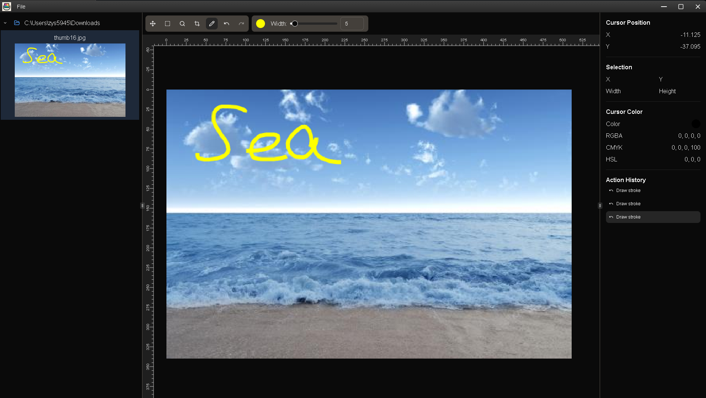

# uclip

Lightweight image annotation application built with Tauri + React.



## Features

### Image Editing

- Supports selection, cropping, drawing, panning, and zoom
- Full undo/redo system with action history tracking
- Pixel-level selection and drawing capabilities
- Live display of cursor position, color values (RGB, CMYK, HSL), and selection dimensions

### User Interface

- Supports drag and drop file input
- Builtin filesystem browser with real time previews
- Able to save entire edit history as json

## Running Dev Environment

Requirements:

- rust
- nodejs
- pnpm (or any other npm package manager)

In project root, run:

```
pnpm install
pnpm tauri dev
```
